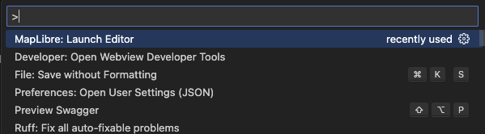

# maplibre-vscode-extension

<https://marketplace.visualstudio.com/items?itemName=kiguchi.maplibre-vscode-extension>

## Usage

1. Install the extension
2. open `style.json` in editor
3. open command palette and run `Maplibre: Viewer`
    - 
4. Viewer will open in new tab. When edit `style.json`, the viewer will update automatically.
    - 
